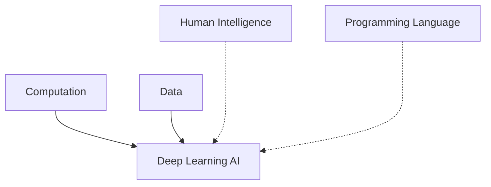
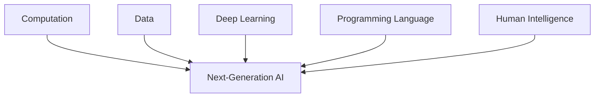
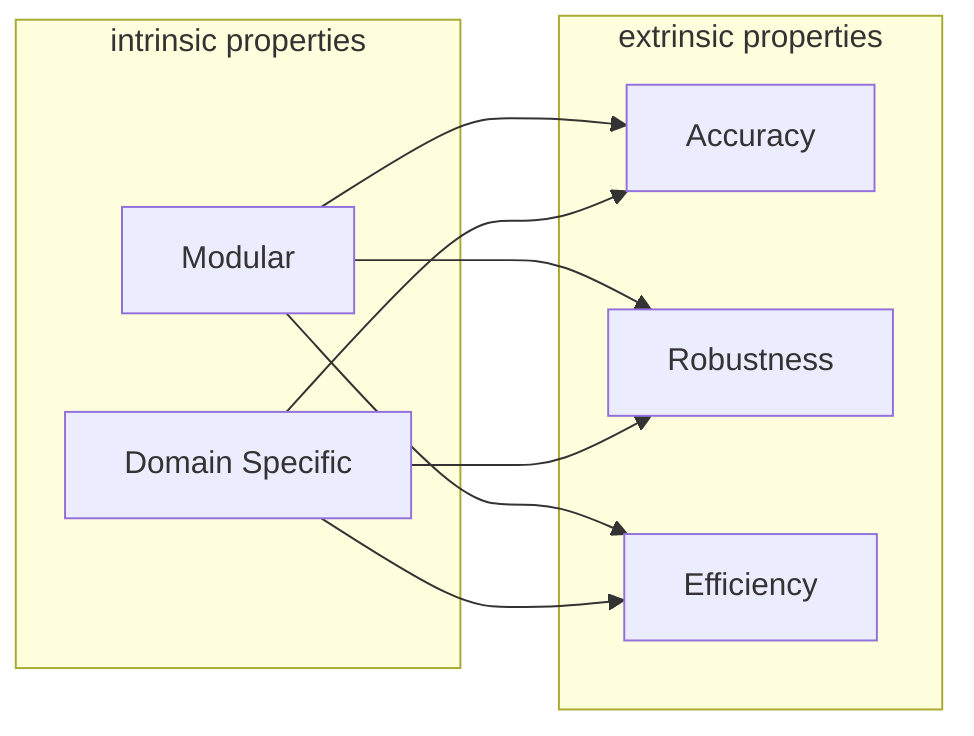
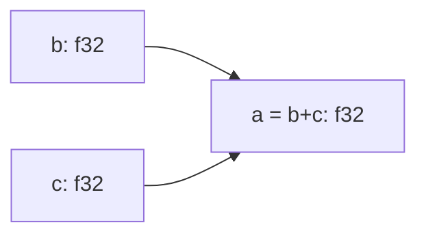

# Husky Programming Language

Empowers everyone towards next-generation AI

<div class="absolute bottom-10">
  <span class="font-700">
    Xiyu Zhai
  </span>
</div>

---

# What is the Husky Programming Language?

An advanced feature-rich system-level programming language for next-generation AI.

We shall explain:

- next-generation AI
- unique features of Husky

---
layout: section
---

# Next-Generation AI

Go beyound deep learning

---

# Deep Learning AI

Currently, AI are dominated by deep learning thanks to its scalability with respect to computation and data.

<div class="grid grid-cols-2 gap-4 pt-4 -mb-6">



</div>

However, deep learning doesn't take much advantage of human intelligence and programming language.

---

# Next Generation AI

We claim that next generation AI is going to take great advantage of human intelligence and programming language.

<div class="grid grid-cols-2 gap-4 pt-4 -mb-6">



</div>

---

# Next Generation AI

Next generation AI is going to be **modular** and **domain specific**.

<div class="grid grid-cols-2 gap-4 pt-4 -mb-6">



</div>

Leads to good properties, i.e. **accuracy**, **robustness**, **efficiency**.

---

# Reinvent Computation Graph

Node value can be of any type instead just being tensors

<div class="grid grid-cols-2 gap-4 pt-4 -mb-6">




</div>

<div class="grid grid-cols-2 gap-4 pt-4 -mb-6">

```mermaid {scale: 0.9}
graph LR;
  a[a = b.distance_to(c): f32]
  b[b: Curve]
  c[c: Curve]
  b --> a;
  c --> a;
```

</div>